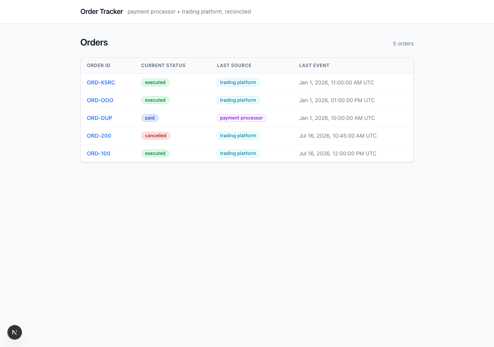
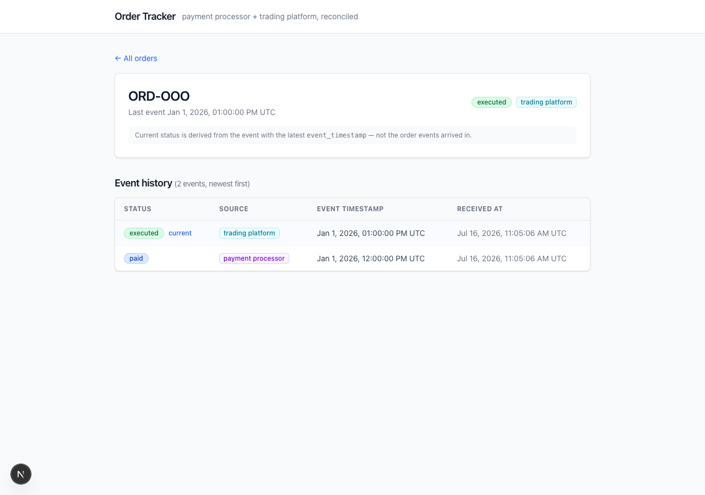

# Blue Guardian — Order Event Reconciliation

A full-stack system that ingests order state-change events from two upstream
systems (a **payment processor** and a **trading platform**) that can deliver
events **duplicated**, **out of order**, and **in conflict** — and always
presents a single, deterministic current state per order.

```
blue-guardian-orders/
├── docker-compose.yml      # PostgreSQL 16 (host port 5433)
├── order-events-api/       # Django 5.2 + DRF backend
└── order-tracker-ui/       # Next.js 15 + Tailwind CSS frontend
```

## Conflict Resolution Strategy

> **The event with the latest `event_timestamp` wins.**

- The order's `current_status` / `last_source` are a **projection derived from
  the full event history**, recomputed on every accepted event — never from
  insertion order. A late-arriving *older* event is stored in the history but
  can never regress the current status.
- **Tie-break (documented & deterministic):** if two events carry the exact
  same `event_timestamp` (e.g. from different sources), the event that was
  **received first** wins.
- **Idempotency:** an event is uniquely identified by
  `(order_id, event_timestamp, source)`, enforced by a database unique
  constraint. A redelivery of the same triple is acknowledged with `200 OK`
  and `"duplicate": true` — it is never stored or processed twice. (A
  redelivery with the same triple but a *different* status body is still
  treated as a duplicate; the triple is the identity.)
- **Concurrency:** ingestion runs in a transaction that takes a row lock on
  the order (`SELECT ... FOR UPDATE`), so concurrent deliveries for the same
  order serialize and the projection is always recomputed from committed
  history. The unique constraint is the final backstop against races.

Implementation: [`order-events-api/orders/services.py`](order-events-api/orders/services.py)
(ingestion + reconciliation), [`order-events-api/orders/models.py`](order-events-api/orders/models.py)
(constraints).

## How to Run

Prerequisites: Docker, Python 3.12+ (developed on 3.14), Node 18.18+.

### 1. Database

```bash
docker compose up -d          # PostgreSQL 16 on host port 5433
```

(Port **5433** is used on the host to avoid clashing with any local Postgres
on 5432. Override with `DB_PORT` if needed — see `order-events-api/.env.example`.)

### 2. Backend (Django) — http://localhost:8000

```bash
cd order-events-api
python3 -m venv .venv && source .venv/bin/activate
pip install -r requirements.txt
python manage.py migrate
python manage.py runserver 8000
```

### 3. Frontend (Next.js) — http://localhost:3000

```bash
cd order-tracker-ui
npm install
npm run dev
```

The frontend reads `NEXT_PUBLIC_API_URL` (default `http://localhost:8000/api`);
copy `.env.local.example` to `.env.local` to point it elsewhere.

### Run the tests

13 tests covering idempotent redelivery, out-of-order arrival, cross-source
conflicts, the timestamp tie-break, validation, and the read endpoints:

```bash
cd order-events-api
python manage.py test
```

## API

| Method | Path | Purpose |
|---|---|---|
| POST | `/api/webhooks/order-events/` | Ingest an event (idempotent) |
| GET | `/api/orders/` | Paginated list (`{count, next, previous, results}`, 50/page) of orders with reconciled current state |
| GET | `/api/orders/<order_id>/` | One order + full event history |

### Webhook payload

```bash
curl -X POST http://localhost:8000/api/webhooks/order-events/ \
  -H 'Content-Type: application/json' \
  -d '{
        "order_id": "ORD-100",
        "status": "executed",
        "event_timestamp": "2026-07-16T12:00:00Z",
        "source": "trading_platform"
      }'
```

Responses: `201` (processed), `200` + `"duplicate": true` (redelivery,
skipped), `400` (invalid payload). Timestamps are ISO 8601; naive timestamps
are interpreted as UTC.

### Try the failure modes

```bash
W=http://localhost:8000/api/webhooks/order-events/
H='Content-Type: application/json'

# 1. Normal event
curl -X POST $W -H "$H" -d '{"order_id":"ORD-1","status":"pending","event_timestamp":"2026-07-16T10:00:00Z","source":"payment_processor"}'
# 2. Exact duplicate -> 200, duplicate:true, not re-processed
curl -X POST $W -H "$H" -d '{"order_id":"ORD-1","status":"pending","event_timestamp":"2026-07-16T10:00:00Z","source":"payment_processor"}'
# 3. Newer event -> status becomes "executed"
curl -X POST $W -H "$H" -d '{"order_id":"ORD-1","status":"executed","event_timestamp":"2026-07-16T12:00:00Z","source":"trading_platform"}'
# 4. Late OLDER event -> stored in history, status stays "executed"
curl -X POST $W -H "$H" -d '{"order_id":"ORD-1","status":"paid","event_timestamp":"2026-07-16T11:00:00Z","source":"payment_processor"}'
```

## Troubleshooting

**"Could not reach the orders API" in the frontend** almost always means the
URL in `NEXT_PUBLIC_API_URL` isn't this project's Django server. Common cause:
another app already listening on port 8000 (check with `lsof -nP -i :8000`).
Either free the port, or run Django elsewhere and point the UI at it:

```bash
python manage.py runserver 8001
echo 'NEXT_PUBLIC_API_URL=http://localhost:8001/api' > order-tracker-ui/.env.local
# restart `npm run dev` after changing .env.local
```

## Screenshots

| Order list | Order detail (out-of-order case) |
|---|---|
|  |  |

## Data Model

- **`Order`** — one row per `order_id`; holds the reconciled projection
  (`current_status`, `last_source`, `last_event_timestamp`).
- **`OrderEvent`** — immutable append-only history of every accepted
  delivery, with `UNIQUE (order, event_timestamp, source)` for deduplication
  and an index on `(order, -event_timestamp)` so recomputing the winner is a
  single indexed `LIMIT 1` query.

## Time Spent

~3 hours total: backend models/ingestion/tests ≈ 1.5 h, frontend ≈ 1 h,
smoke-testing both failure modes end-to-end + docs ≈ 0.5 h.

## Tradeoffs

- **Projection stored on `Order` vs. computed on read.** Statuses are
  read far more often than written, so the reconciled state is recomputed
  once per accepted event (a single indexed query under the order's row
  lock) and reads are plain lookups. The event history remains the source
  of truth, so the projection can always be rebuilt.
- **No event-sourcing framework.** Per the brief, this solves exactly this
  problem: one unique constraint, one transaction, one recompute query.
- **Tie-break = first received.** With identical timestamps there is no
  objectively "later" event; first-received is deterministic and never
  flip-flops on redelivery. A production alternative is a source-priority
  rule (e.g. trading platform outranks payment processor) — one line to
  change in `recompute_order_state`.
- **Webhook is unauthenticated.** Fine for a local exercise; in production
  it would verify an HMAC signature per source and likely enqueue events for
  async processing instead of ingesting synchronously.
- **Trusting `event_timestamp` from the source.** The whole design keys off
  the sender's clock; if upstream clocks skew badly, resolution follows the
  skew. Mitigation would need per-source sequence numbers, which the payload
  doesn't include.
- **Server-rendered frontend with no client state library** — the pages
  fetch fresh data per request (`force-dynamic`), which keeps the UI dead
  simple; polling/websockets could be added for live updates.
